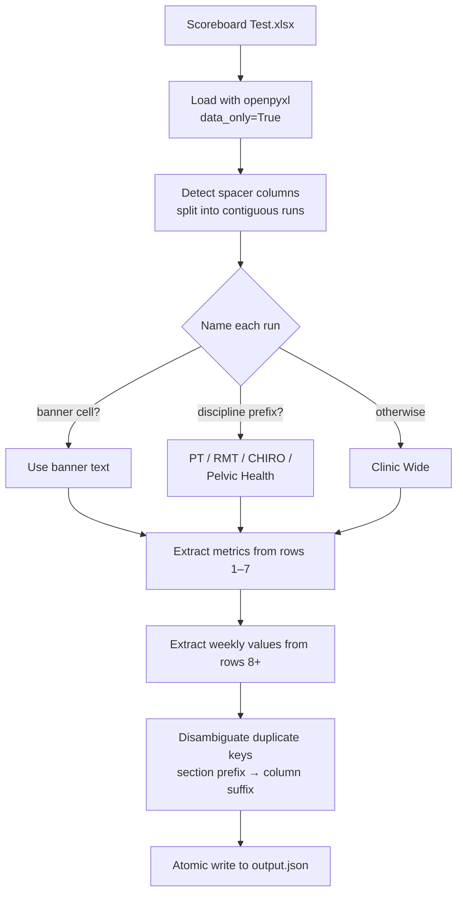

# Scoreboard → JSON

A Python script that converts the clinic performance scoreboard
(`Scoreboard Test.xlsx`) into a JSON document that another developer, a
dashboard, or an LLM can immediately query — preserving every cell value
along with the metadata that gives it meaning.

```
clara/
├── convert.py            ← the script
├── requirements.txt      ← single dependency: openpyxl
├── output.json           ← generated artifact
├── README.md             ← this file
└── resources/
    ├── Scoreboard Test.xlsx
    └── Test Explaination.pdf
```

---

## How to run it

```bash
python -m venv .venv && source .venv/bin/activate
pip install -r requirements.txt
python convert.py "resources/Scoreboard Test.xlsx" -o output.json
```

That writes `output.json` at the project root. A one-line summary
prints to stdout. Run with `-v` for `INFO` logging or `-vv` for `DEBUG`;
`python convert.py --help` lists every flag.

**Exit codes:** `0` success · `2` input not found · `3` workbook is
structurally invalid · `4` unexpected internal error.

---

## The JSON shape, and why

The scoreboard is really three things stacked together:

| Layer | What it is | Source rows / cols |
|---|---|---|
| **Per-metric metadata** | name, focus, source, role, target | rows 1–7 |
| **Logical sections** | clinic-wide vs. per-discipline blocks | spacer columns + banner |
| **Weekly data** | one row per week-ending date | rows 8+ |

The output keeps these as three top-level lists, so a consumer can treat
the file as a small relational dataset:

```json
{
  "source_file": "Scoreboard Test.xlsx",
  "sheet": "SCOREBOARD",
  "schema_version": "1.0.0",
  "generated_at": "2026-05-04T20:19:11Z",
  "sections": [
    { "name": "Clinic Wide", "metric_keys": ["total_revenue_all_services", "..."] },
    { "name": "PT",          "metric_keys": ["pt_total_revenue", "..."] }
  ],
  "metrics": [
    {
      "key":     "total_revenue_all_services",
      "label":   "Total Revenue - All Services",
      "section": "Clinic Wide",
      "focus":   "Financial",
      "source":  "EMR",
      "role":    "J",
      "target":  null,
      "column":  "B"
    }
  ],
  "weeks": [
    {
      "week_ending": "2026-02-09",
      "values": {
        "total_revenue_all_services": 42360.64,
        "ar_90_days": 182.0,
        "pt_total_revenue": 36099.38
      }
    },
    {
      "week_ending": "2026-02-02",
      "values": {
        "total_revenue_all_services": 39202.17,
        "pelvic_health__pva_4_wk_avg": { "error": "#REF!" }
      }
    }
  ]
}
```

**Why this shape and not a flatter one:**

| Alternative | Strength | Weakness |
|---|---|---|
| Metric-first (each metric carries its weekly values) | Trends are O(1) | "Everything for Feb 9" is a scan |
| Week-first with values inline (no metrics list) | Simple | Loses metadata — numbers without focus/source/role/target are just numbers |
| **Three lists joined on `metric.key`** *(chosen)* | Both axes are O(n); schema stays normalised | Slightly more verbose |

`metrics` is the schema. `weeks[].values` is the fact table. `metrics[i].key`
is the join key. A consumer can pick the axis that suits the query.

### Conversion pipeline



---

## What I did with the messy bits

### Layered headers (rows 1–7)

Treated as fixed slots, every one of which carries information about a
column:

| Row | Meaning | Example |
|---|---|---|
| 1 | Section banner *(usually empty)* | `PHONE PERFORMANCE` (merged AJ:AP) |
| 2 | Metric name (canonical header) | `Total Revenue - All Services` |
| 3 | Focus area | `Financial`, `Marketing`, `Caseload` |
| 4 | Upstream source | `EMR`, `Jane`, `CallHero`, `Formula` |
| 5 | Person responsible | `J`, `Beth`, `Nicole`, `Paula` |
| 6 | Literal word "Target" | *(skipped)* |
| 7 | Target value or note | `Target = 75%`, `100% Target` |

All of rows 1–5 and 7 land on the `Metric` object. Nothing about a column's
meaning is thrown away.

### Spacer columns

Columns with no content in any row (S, X, AF, AI, AQ, BB, BE, BI, CF, CH,
CI, DB, DN, DZ, EE, EH) are dropped from the output but used as
**section boundaries** during the left-to-right walk. Visual breathing
room becomes structure.

### Section names — deliberately conservative

The source only labels sections explicitly two ways:

1. A merged banner cell in row 1 (only `PHONE PERFORMANCE` qualifies).
2. A discipline prefix on the metric label (`PT `, `RMT `, `CHIRO `, `Pelvic Health`).

I deliberately do **not** invent section names from "first word of the
first metric" — that produces noise like `FB` or `Cancelled` for groups
that aren't really their own thing. Everything that doesn't match a
hard rule collapses into `Clinic Wide`.

Result: 6 sections rather than ~16 spurious ones.

### Duplicate metric labels

Some labels appear more than once in the workbook:

- *Across* discipline blocks: `PVA (4 wk avg)` recurs under PT, RMT, Chiro, and Pelvic Health.
- *Within* a section: `Utilization` appears twice in the Clinic Wide run alone.

Two-pass disambiguation keeps keys unique without inventing meaning:

1. Prefix with the section slug → `pt__pva_4_wk_avg`, `rmt__pva_4_wk_avg`, …
2. If still colliding, append the column letter → `clinic_wide__utilization_eg` vs `clinic_wide__utilization_el`.

The original label is preserved verbatim on `metric.label`.

### Formulas

Read with `data_only=True`, so the JSON contains the **cached results** —
the numbers a user sees opening the workbook in Excel — not the formula
strings. *Trade-off*: if a formula was edited but never recalculated by
Excel, the cached value is stale. For a scoreboard this is the right
call; for a financial model I'd want both formula text and cached value.

### Excel error tokens

`EC10` evaluates to `#REF!`. Rather than coerce that to `null` (silently
lossy) or pass it through as an ambiguous string, errors come through as
a structured object:

```json
"pelvic_health__pva_4_wk_avg": { "error": "#REF!" }
```

A downstream consumer can distinguish "no data recorded" from "broken
formula" with a single `isinstance` check.

### Other small decisions

| Messy bit | Decision | Trade-off |
|---|---|---|
| Numeric strings (`"2.87"`, `"3.26"`) | Coerce to `float` / `int` | Strictly lossless would keep them as strings, but that forces every consumer to re-detect numerics |
| Dates | ISO-8601 (`2026-02-09`) | Excel serial dates would be lossless but unfriendly |
| Unlabeled column U | Keep with `label: null`, synthesised key `col_u` | Data isn't silently dropped; the absence of a header is signaled explicitly |
| Empty cells | Omitted from `weeks[i].values` entirely | ~halves output size; `key in values` becomes a meaningful predicate |
| Output writes | Atomic via tempfile + `os.replace` | A crashed run can never leave a half-written `output.json` |
| Schema | Versioned (`schema_version: "1.0.0"`) | Lets downstream code detect breaking changes |

### Result against the reference workbook

| Metric | Value |
|---|---|
| Sections detected | **6** (Clinic Wide, Phone Performance, PT, RMT, CHIRO, Pelvic Health) |
| Metrics extracted | **125** (all keys unique, all match `[a-z0-9_]+`) |
| Weeks of data | **3** |
| Non-null source cells preserved | **181 / 181** (verified end-to-end) |
| Excel errors preserved | **1** (`#REF!` in EC10) |

---

## With another two hours

- **Multi-sheet support.** The workbook has one sheet so I didn't
  generalise, but a top-level `sheets: { ... }` map would extend cleanly
  and the existing `--sheet` flag already half-implements it.
- **A JSON Schema document** alongside the output, so a downstream
  service can validate and an LLM has a clear contract to reason about.
- **Per-cell provenance.** `metric.column` already gives column-level
  traceability; adding the row reference (e.g. `H9`) to each value would
  let any number in the JSON be traced back to a specific workbook cell.
- **Optional formula preservation.** A second pass with
  `data_only=False` to attach formula text to each `Metric` would let a
  consumer see *how* a value was computed, not just what it was.
- **A small test suite.** Golden-file tests pinning a handful of
  spot-check values (e.g. `total_revenue_all_services` on `2026-02-09`
  is exactly `42360.64`) would make regressions in the converter
  impossible to ship silently.
- **A `--strict` flag** that fails with a non-zero exit code if any
  Excel error tokens were encountered, for use in CI pipelines that
  expect clean source data.
